# Trellix EX Attachment Decrypt — Engineering & Operations Documentation

> Single-document build (Markdown + HTML). Regenerate with the docs build script; the
> Word (`.docx`) export is kept local and is not committed.

## Contents

- [Overview](#doc-01_overview)
- [Architecture](#doc-02_architecture)
- [Flow & States](#doc-03_flow_and_states)
- [Code Reference](#doc-04_code_reference)
- [Data Model](#doc-05_data_model)
- [Security](#doc-06_security)
- [User Guide](#doc-07_user_guide)
- [Tech Stack](#doc-08_tech_stack)

# 1. Overview

## The problem

Trellix Email Security (EX) inspects inbound email and detonates attachments in a
sandbox (MVX). When an attachment is **password-protected** — an encrypted PDF, a
password-locked Office document, or an encrypted ZIP — EX cannot open it, cannot
prove it is safe, and therefore **quarantines the email** and raises a *riskware*
alert (`RISKWARE_OBJECT` with a `CustomPolicy.MVX.<ext>` malware name).

Legitimate senders routinely encrypt attachments and send the password separately.
Without automation, every such email becomes a manual help-desk ticket: find the
recipient, ask them for the password, log in to the EX console, resubmit the email
for re-analysis, and watch the result. This service automates that entire loop.

## What the service does

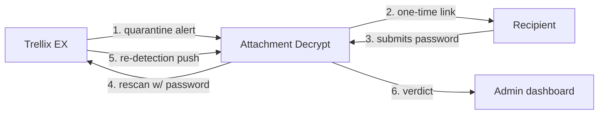

1. **Receive** — EX posts a quarantine alert to the service's webhook.
2. **Ask** — if the alert matches the configured encrypted-attachment trigger, the
   service emails every recipient a randomized, single-use, expiring link.
3. **Collect** — a recipient opens the link and submits the attachment password.
4. **Resubmit** — the service calls the EX *rescan* API, handing EX the password so
   it can open and re-analyze the attachment.
5. **Re-detect** — EX re-analyzes and pushes the re-detection back to the webhook
   (under the original queue id with an `_RA` suffix).
6. **Conclude** — the service determines the outcome and records it:
   - **Wrong password** → the attachment is still encrypted → email the recipient
     again, up to a retry cap.
   - **Clean** → EX released and delivered the email → `Passed`.
   - **Malicious / still held** → EX re-quarantined it → `Quarantined`.

Every recipient, email, password attempt, and state change is tracked and visible
in a password-gated web dashboard.

## What it is *not*

- It never sees or stores the attachment itself — only the password, transiently.
- It never makes the malware verdict; **EX** does. The service only orchestrates
  the resubmission and reads EX's answer.
- It stores the password only long enough to complete the rescan, encrypted at
  rest, then purges it.

## Key properties

| Property | How it's achieved |
|----------|-------------------|
| **Fully automated** | Webhook in, email out, rescan, verdict — no human step except the recipient typing the password. |
| **Resilient** | Wrong passwords retry; failed emails and failed rescans are swept and retried; a recheck timer backstops missed pushes. |
| **Safe with the password** | Held encrypted (Fernet) only until the rescan succeeds, then deleted; only a hash is kept for audit. |
| **Operable** | Live dashboard, live-editable settings, health check, connectivity self-test (`--check`). |
| **Self-contained** | One Python process, SQLite by default, no external services beyond EX and an SMTP relay. |

## A one-screen tour

- **Entry points:** `POST /webhook/ex-alert` (from EX), `GET/POST /p/<token>` (the
  recipient), and the admin UI at `/`.
- **The brain:** `domain.FlowEngine` — a pure state machine with no I/O of its own.
- **The transports:** `ex_client.EXClient` (EX API), `mailer.SMTPMailer` (email),
  `storage.CaseRepository` (database), `bounce.BounceMonitor` (IMAP).
- **The state:** one `AttachmentCase` per quarantined email, moving through the
  states in [Flow & States](03_flow_and_states.md).

---

# 2. Architecture

## Design principle

The codebase is **layered around a pure core**. All business logic lives in
`domain.py`, which performs **zero I/O**: it never touches the network, database,
SMTP, or clock directly. Instead the `FlowEngine` calls injected collaborators
(repository, EX client, mailer, scheduler). Every side-effecting concern is
isolated behind one of those collaborators. This is what makes the whole state
machine unit-testable with fakes and no mocking of transports.

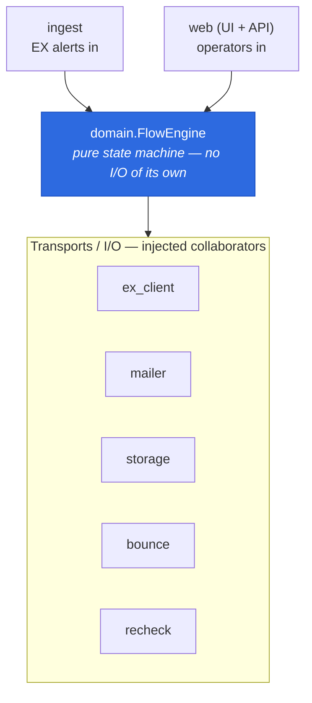

## Component diagram

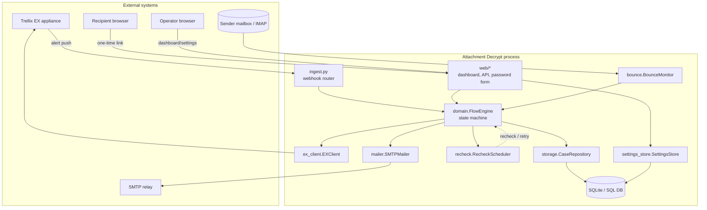

## Module map

| Layer | File | Responsibility |
|-------|------|----------------|
| Entrypoint | `__main__.py` | `python -m trellix_decrypt` / `--check`; starts uvicorn. |
| Composition | `app.py` | Build `Settings`, resolve `SECRET_KEY`, configure logging, wire the `AppContext`, return the FastAPI app. |
| Context | `context.py` | `AppContext` owns the live `FlowEngine`; `reload()` re-wires transports from current settings without a restart. |
| Config | `config.py` | `Settings` (env/`.env`), `resolve_secret_key`, `missing_required`/`is_configured`. |
| Config store | `settings_store.py` | UI-editable overrides layered over env defaults; secrets encrypted at rest. |
| **Core** | `domain.py` | `FlowEngine`, `FlowState`, `RiskwareRules`, `TokenService`, and the pure alert parsers. **No I/O.** |
| EX transport | `ex_client.py` | `EXClient`: auth, alerts, quarantine list/rescan/release/delete, alert-by-uuid. |
| Ingest | `ingest.py` | Webhook router: auth, body cap, parse, dispatch to the engine. |
| Mail | `mailer.py` | `SMTPMailer` + Jinja2 email rendering. |
| Persistence | `storage.py` | ORM models + `CaseRepository` (+ dashboard read models). |
| Web | `web/` | `server.py` (app factory), `auth.py`, `routes_password.py`, `routes_dashboard.py`, `routes_api.py`, `ratelimit.py`. |
| Scheduling | `recheck.py` | asyncio task scheduler: recheck polls + notify/resubmit retry sweeps. |
| Bounce | `bounce.py` | DSN parser + IMAP poller; flips accepted-then-bounced mail to `BOUNCED`. |
| Crypto | `crypto.py` | Fernet helper keyed by `SECRET_KEY`. |

## Two ways in, one brain

There are exactly two inbound triggers, and both funnel into the same
`FlowEngine`:

1. **`ingest.py`** — the EX webhook. It authenticates the caller, caps the body,
   parses alerts with the pure `domain.parse_alert`, and calls
   `engine.handle_alert(event)`. It is the consumer for *both* the first-time
   quarantine alert and the `_RA` re-detection push.
2. **`web/`** — the operator (dashboard, settings, resend/rescan actions) and the
   recipient (password form). Operator surfaces are auth-gated; the password form
   and webhook are public but individually protected (tokens, webhook auth, rate
   limits).

## Async model

Everything is `async` (FastAPI + httpx + aiosmtplib). Background work runs as
tracked asyncio tasks created by `RecheckScheduler`:

- **Recheck poll** (`schedule_recheck`) — after a resubmission, poll the EX
  quarantine list until the `_RA` verdict is known or the attempt budget is spent.
- **Resubmit task** (`schedule_resubmit`) — run the EX rescan in the background so
  the recipient's submission returns instantly, decoupled from EX availability.
- **Retry sweeps** (`start_notify_retrier`, `start_resubmit_retrier`) — periodic
  loops that re-attempt failed emails and failed rescans under their caps.
- **Bounce loop** (`start_loop`) — the IMAP poller.

## Live reconfiguration

The `AppContext` holds one long-lived `FlowEngine`. When settings change through
the UI, `AppContext.reload()` rebuilds the EX client, mailer, token service, and
rules from the new effective settings and swaps them into the *same* engine
instance — so in-flight cases and scheduled tasks keep running while configuration
changes take effect. (Infrastructure settings — bind host/port, logging — are read
at startup and take effect on the next restart; see [Security](06_security.md) and
the [User Guide](07_user_guide.md).)

## Configuration precedence

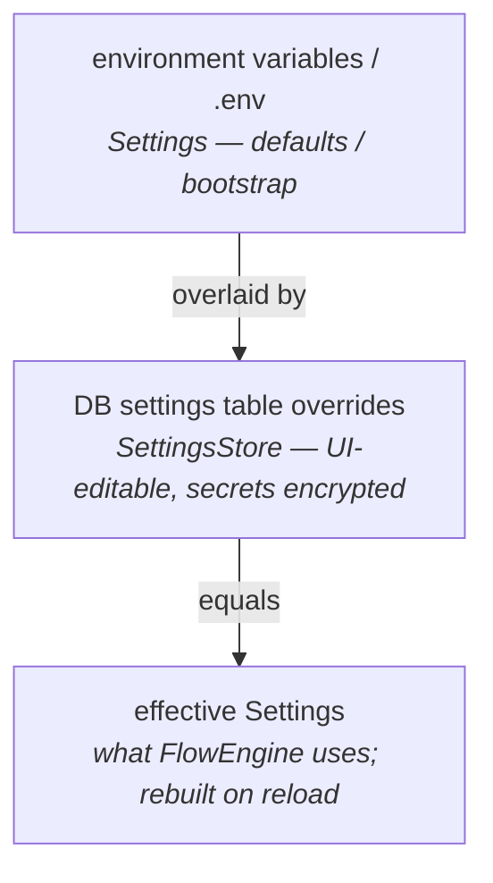

`SECRET_KEY` and `DB_URL` are the two settings that are **not** UI-editable — they
bootstrap the very mechanisms (secret encryption, the database) the overrides rely
on, so they must come from the environment (or, for `SECRET_KEY`, be auto-generated
and persisted to `secret.key`).

## Trust boundaries

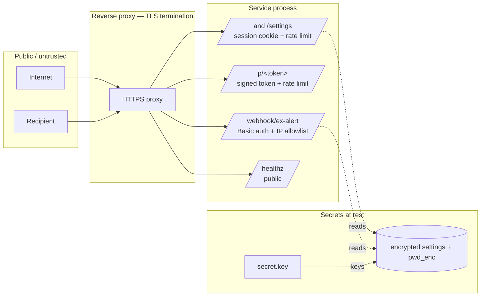

- **HTTPS** is terminated by a reverse proxy in front of the service.
- The **webhook** requires HTTP Basic auth and/or a source-IP allowlist.
- The **password form** is public by necessity but guarded by unguessable signed
  tokens and a per-IP+token rate limit.
- The **admin surfaces** require a signed session cookie; login is rate-limited.
- **Secrets at rest** (settings secrets, the transient attachment password) are
  Fernet-encrypted with a key derived from `SECRET_KEY`.

---

# 3. Flow & States

This is the heart of the system: the `FlowEngine` state machine in `domain.py` and
the sequences that drive transitions.

## The states

`FlowState` (in `domain.py`) enumerates every state a case can be in:

| State | Meaning | Terminal? |
|-------|---------|-----------|
| `RECEIVED` | Alert matched; case created. | no |
| `AWAITING_PASSWORD` | One-time link emailed; waiting for the recipient. | no |
| `PASSWORD_SUBMITTED` | Recipient submitted the password (held encrypted). | no |
| `RESUBMITTED` | EX rescan issued with the password. | no |
| `RECHECKING` | Polling EX for the `_RA` re-detection verdict. | no |
| `DONE_PASSED` | Not re-quarantined → released & delivered. | **yes** |
| `DONE_QUARANTINED` | Re-quarantined → still held. | **yes** |
| `FAILED_MAX_RETRIES` | Wrong password too many times; gave up. | yes* |
| `EXPIRED` | Case aged out without completion. | **yes** |
| `NOTIFY_FAILED` | SMTP error handing off the email (auto-retried, resendable). | no |
| `BOUNCED` | Email accepted then bounced (DSN); resendable. | **yes** |
| `RESUBMIT_FAILED` | Password captured but EX rescan failed (retryable). | no |

\* `FAILED_MAX_RETRIES` is an end-of-line for the retry loop but is not in the
`TERMINAL` set used for bounce-suppression; it is a settled outcome.

Two named groups drive the logic:

- **`RECHECKABLE`** = `{RESUBMITTED, RECHECKING}` — states from which a recheck poll
  or a pushed verdict may still resolve the case.
- **`TERMINAL`** = `{DONE_PASSED, DONE_QUARANTINED, FAILED_MAX_RETRIES, EXPIRED,
  BOUNCED}` — settled states that a late bounce must not overwrite.

## State machine

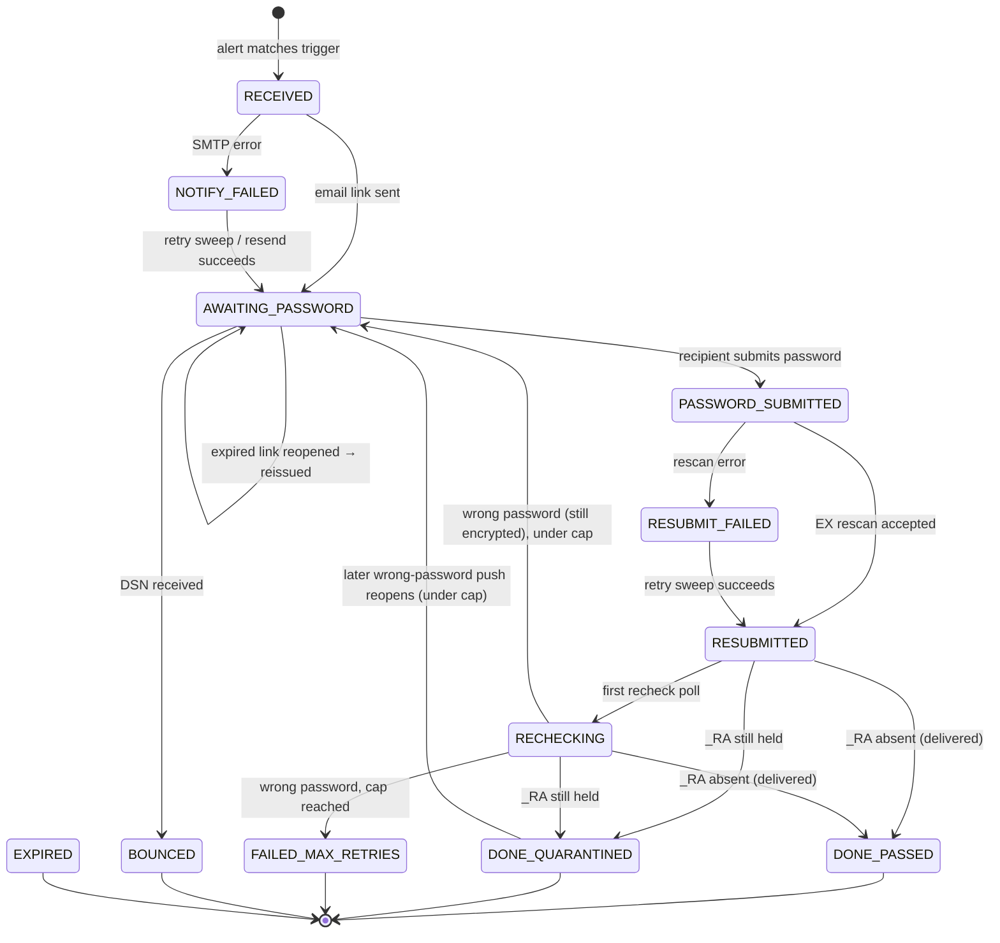

## Journey 1 — Alert to password request

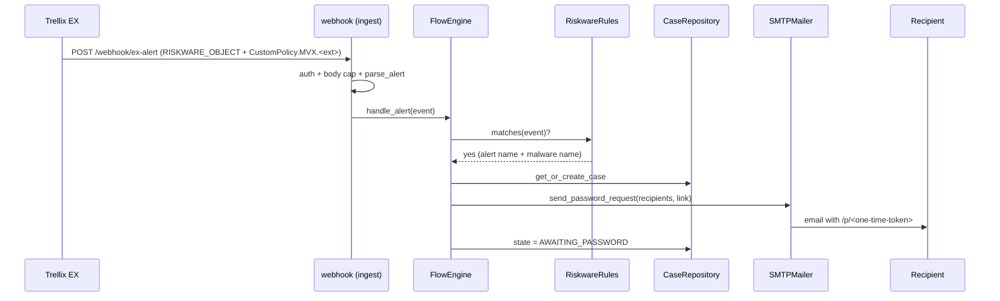

If the SMTP hand-off fails, the case goes to `NOTIFY_FAILED` and the notify-retry
sweep re-attempts it (and an operator can "Resend" from the dashboard).

## Journey 2 — Password to rescan

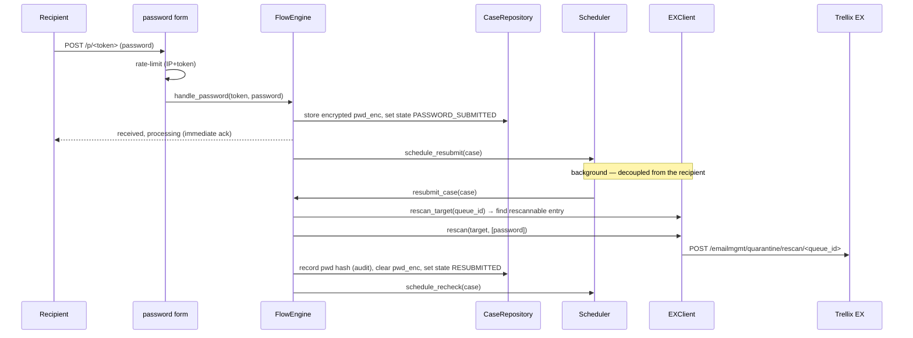

The recipient's success does **not** depend on EX being reachable: the password is
stored encrypted and acknowledged immediately, and the rescan runs in the
background, retrying under `resubmit_max_retries` if EX is briefly down.

## Journey 3 — Re-detection classification (`_RA` push)

EX re-analyzes the resubmission and pushes the re-detection to the same webhook,
under `<queue_id>_RA`. The push only *triggers* a decision — the verdict is
confirmed from the authoritative quarantine list.

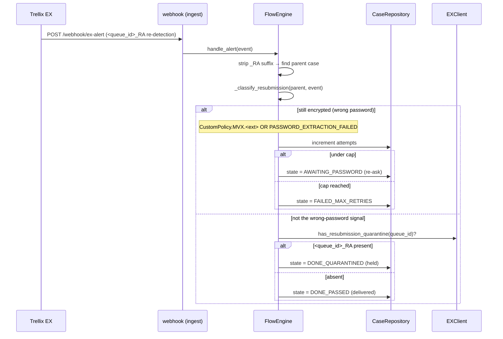

### Why the verdict comes from the quarantine list, not the push

A riskware rule can *alert without quarantining* (alert-but-allow), so a push
proves only that re-analysis happened — not that the email is held. The engine
therefore confirms held-vs-passed from `ex_client.has_resubmission_quarantine`,
which asks the actual quarantine list: **is there a record whose queue id is
exactly `<queue_id>_RA`?** Present → held; absent → delivered.

### Wire-format gotchas (lab-verified)

- Pushed alert names are hyphenated lowercase (`riskware-object`), so names are
  compared via `domain._canon_name`, never `== "RISKWARE_OBJECT"`.
- One `_RA` can arrive as several separate webhook POSTs (one per detected object),
  so classification is **order-independent**: a later `PASSWORD_EXTRACTION_FAILED`
  push reopens a case a re-quarantine confirm had already moved to
  `DONE_QUARANTINED`, and repeat pushes count as one attempt.
- The still-encrypted marker is **authoritative** and wins over any malware verdict
  (the wrong-password path is checked first).

## Journey 4 — Recheck backstop (no push)

Not every deployment pushes re-detections. The recheck timer runs the same
quarantine-list confirmation so the verdict is reached even with no push.

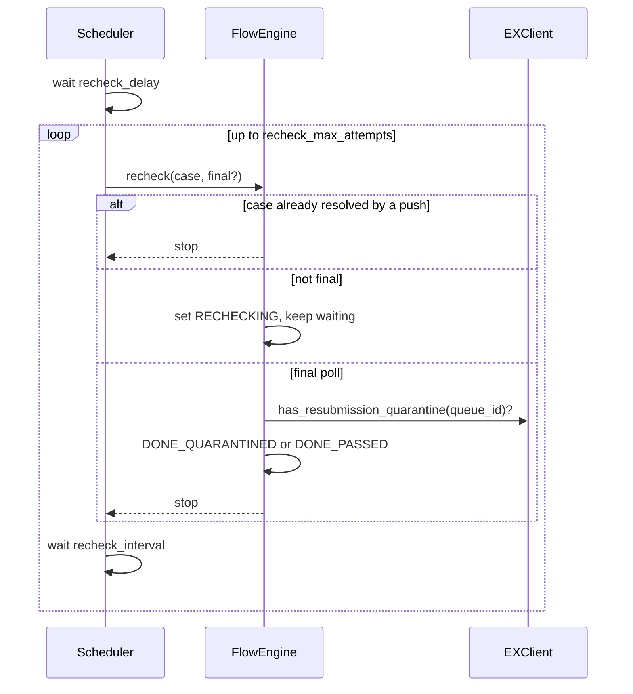

## Correlation & clock-independence (two subtle invariants)

1. **`_RA` correlation** — a re-detection is joined to its parent case by *stripping*
   the `_RA` suffix(es) and matching the queue id (`find_case_by_queue_id`). An `_RA`
   alert is **never** turned into a new case.
2. **Clock-independent quarantine window** — per-case quarantine lookups query EX
   over a fixed 2000–2100 window, never a `now()`-relative one. EX filters the list
   by *its* clock; if we computed the window on *ours*, a skewed appliance clock
   would push the very `_RA` entry we need out of view — making a held email read as
   passed (the dangerous direction) or a rescan report "queue id not found". This was
   observed live and fixed by decoupling the window from both clocks. See
   [Code Reference](04_code_reference.md) → `ex_client`.

---

# 4. Code Reference

Module-by-module reference of the public classes and functions and their
contracts. Signatures are illustrative; the source is the authority.

---

## `domain.py` — pure core (no I/O)

### Enums & constants
- `FlowState(str, Enum)` — every case state (see [Flow & States](03_flow_and_states.md)).
- `RECHECKABLE` — `{RESUBMITTED, RECHECKING}`.
- `TERMINAL` — settled states a late bounce must not overwrite.
- `PASSWORD_FAILED_MARKERS` — `{"password_extraction_failed"}`; the authoritative
  wrong-password marker.

### Helpers
- `_canon_name(value) -> str` — canonicalize an EX name (lowercase, trim,
  `-`→`_`) so `MALWARE-OBJECT` == `malware_object`. **Always** compare names through
  this, never `==` a literal.
- `_detection_summary(event) -> str` — compact detection string (alert name +
  malware names + `(malicious)`) folded into the timeline; empty when there's no push.

### `AlertEvent` (dataclass)
Normalized EX alert: `queue_id`, `recipients`, `alert_name`, `malicious`, `sender`,
`subject`, `malware_names`, `raw`. `.recipient` returns the first recipient.

### `RiskwareRules`
Decides whether an alert triggers the flow.
- `matches(event) -> bool` — true iff the top-level alert name equals the configured
  trigger name **and** one malware name exactly equals a configured trigger malware
  name (case-insensitive). Empty trigger-name list → nothing matches (disabled).
- `name_matches` / `alert_name_matches` — the two halves of that test.

### `TokenService`
Mint/verify signed, TTL-expiring one-time links carrying a case id.
- `mint(case_id) -> str`
- `verify(token) -> str | None` — case id for a valid, **unexpired** token.
- `peek(token) -> str | None` — case id for a validly-signed token **regardless of
  age** (used to accept a just-expired link the recipient is actively submitting;
  single use is still enforced by case state).

### `hash_password(password) -> str`
SHA-256 hex, for de-duping/audit. Plaintext is never persisted.

### `FlowEngine` — the state machine / orchestrator
Constructed with injected collaborators: `repo, ex, mailer, tokens, rules, settings,
scheduler`. Key methods:

| Method | Contract |
|--------|----------|
| `handle_alert(event)` | Entry point for an incoming alert. Correlates `_RA` re-detections to the parent (classifies, never creates a case); otherwise gates on the trigger rules and starts the flow. Returns the case or `None`. |
| `handle_password(token, password)` | Store the password encrypted, ack immediately, schedule the background rescan. Returns `(case_or_None, status)`. |
| `resubmit_case(case_id)` | Background: decrypt the held password, find the rescannable entry, call EX rescan; on success record the hash, purge the password, schedule recheck; on failure count + `RESUBMIT_FAILED`. |
| `recheck(case_id, final)` | Timeout backstop: confirm the outcome from the quarantine list on the final poll. Returns `True` to stop polling. |
| `reissue_expired_link(token)` | Re-email a fresh link if an expired-but-valid link is opened while still `AWAITING_PASSWORD`. |
| `resend(case_id)` | Operator-triggered re-send for `NOTIFY_FAILED`/`AWAITING_PASSWORD`/`BOUNCED`. |
| `handle_bounce(bounce)` | Mark a case `BOUNCED` (correlate by `X-Case-Id`, else recipient); never overrides a terminal state. |
| `alert_details_for_case(case_id)` | **Display-only**: fetch every alert UUID for the case's quarantine records and return parsed detail. Best-effort; never a flow decision. |
| `resume_pending()` | On startup, reschedule mid-flight rechecks and resubmissions. |
| `retry_failed_notifications()` / `retry_failed_resubmissions()` | Background sweep bodies. |

Private decision helpers: `_still_encrypted`, `_confirm_outcome`,
`_classify_resubmission`, `_fail_extraction`, `_send_password_request`.

### Pure alert parsers
- `iter_alerts(payload) -> list[dict]` — unwrap `Alerts`/`alerts`/`alert`/bare.
- `parse_alert(alert) -> AlertEvent` — map a raw alert (either wire format:
  camelCase query JSON or hyphenated `{"value": …}` push) to an `AlertEvent`.
- `parse_alert_detail(alert) -> dict` — compact display view for the drawer.
- `split_addrs`, `_text`, `_text_list`, `_dig`, `_first`, `_is_yes`,
  `_malware_entries` — tolerant field extractors covering both wire formats.

---

## `ex_client.py` — Trellix EX transport

All endpoint paths are defined at the top of the file (the single place to adjust
for another appliance): `EP_LOGIN`, `EP_ALERTS`, `EP_ALERT_DETAILS`,
`EP_QUARANTINE`, `EP_QUARANTINE_RESCAN`, `EP_QUARANTINE_RELEASE`,
`EP_QUARANTINE_DELETE`. API version `v2.0.0`.

### `EXClient`
- Auth: `X-FeApi-Token` (+ optional `X-FeClient-Token`), lazy login, automatic
  single re-auth on `401` (EX's 15-min idle timeout).
- `get_alerts(**filters)` — alerts query.
- `get_alert_by_uuid(uuid) -> dict | None` — full alert detail by UUID
  (undocumented endpoint; display-only). `None` on not-found.
- `list_quarantine(sender, subject, since, until, **params)` — quarantine list;
  `since`/`until` widen EX's default 24h window (padded by `_TIME_SKEW`).
- `rescan_target(queue_id, sender, subject) -> (queue_id, email_uuid)` — pick the
  **rescannable** entry (one with a real `quarantine_path`; `_RA` records have a null
  path and can't be rescanned).
- `rescan(target_id, passwords)` — `POST …/rescan/<id>` with
  `{"rescan_properties": {"pwd_list": [...]}}`.
- `has_resubmission_quarantine(queue_id, sender, subject) -> bool` — **authoritative
  verdict**: is there a record whose queue id is exactly `<queue_id>_RA`? Exact
  suffix match (via `_strip_ra`), never a loose prefix.
- `alert_uuids_for(queue_id, sender, subject) -> list[str]` — all alert UUIDs on the
  case's quarantine records, deduped, order-preserved.
- `release(queue_ids)` / `delete(queue_ids)` — quarantine actions.

### Clock-independence (critical)
`_list_for_case` sends a **fixed 2000–2100 window** for all per-case lookups
(`rescan_target`, `has_resubmission_quarantine`, `alert_uuids_for`). EX filters by
its own clock; a now-relative window computed on ours breaks under clock skew. **Do
not** make this window now-relative. `list_quarantine` still accepts `since`/`until`
for other callers/tests.

### Errors
- `EXAuthError` — login failure.
- `EXApiError(message, status_code, body)` — any non-2xx; `.not_found` recognizes
  EX's "email not quarantined / invalid queue id" 400/404 bodies.

### Helpers
`_qid`, `_strip_ra` (removes one-or-more `_RA` suffixes), `_ex_time`
(`YYYY-MM-DDTHH:MM:SS.SSS±HHMM`), `_as_quarantine_list`.

---

## `ingest.py` — webhook

- `build_webhook_router(ctx)` → `POST /webhook/ex-alert`. In order: **503 if not
  configured** (setup mode); require Basic auth and/or IP allowlist; **cap the body**
  at `max_request_bytes`; parse; dispatch each alert to `engine.handle_alert`.
- `_basic_credentials(request)` — decode the `Authorization: Basic` header.
- `AlertSource(ABC)` — pluggable transport interface (syslog etc. later).

---

## `web/` — HTTP surfaces

| File | Contents |
|------|----------|
| `server.py` | `create_app(ctx)`: mount static, include routers, lifespan (resume pending + start sweeps + bounce loop), `/healthz`. |
| `auth.py` | Shared-password admin session: `check_password` (constant-time), `issue_session`, `is_authenticated`, cookie `ui_session` (12h TTL). |
| `routes_password.py` | Public `/p/<token>`: GET renders/reissues, POST rate-limits then `handle_password`. |
| `routes_dashboard.py` | `/login`, `/logout`, `/`, `/settings`; login rate-limit; **setup mode** (`in_setup_mode`) opens `/settings` before an admin password exists. |
| `routes_api.py` | Auth JSON API: `/api/status`, `/api/cases`, `/api/cases/<id>`, `…/alerts`, `…/resend`, `…/rescan`, `/api/settings` (GET/POST). Settings endpoints use `_guard_settings` (open in setup mode). |
| `ratelimit.py` | `RateLimiter` (sliding window) + `client_ip` (honors `X-Forwarded-For` only when `trust_forwarded_for`). |

---

## `config.py` — settings

- `Settings(BaseSettings)` — all config from env/`.env`. Operationally-required
  fields default to empty so the app can boot into setup mode.
- `Settings.missing_required() -> list[str]` / `.is_configured() -> bool` — drive
  setup mode; require EX creds, SMTP, public URL, admin password, and webhook auth.
- `Settings.webhook_auth_configured()` — Basic creds and/or IP allowlist present.
- `resolve_secret_key(env_value, key_path) -> str` — explicit env key wins; else
  read/generate+persist a strong key to `key_path`. Placeholder values
  (`change-me`, …) count as unset.
- `INSECURE_SECRET_KEYS` — placeholders treated as unset.

## `settings_store.py`
- `SettingsStore(env, session_factory)`: `effective_settings()` (env overlaid with
  DB overrides), `masked()` (secrets shown as `********`), `update(changes)`.
- `EDITABLE` — UI-editable keys (everything except `SECRET_KEY` and `DB_URL`).
- `SECRET_KEYS` — encrypted at rest (includes `ui_password`).
- `LIST_KEYS` — CSV list fields (`trigger_malware_names`, `webhook_ip_allowlist`).
- `RESTART_REQUIRED` — editable but applied on restart (bind host/port, logging,
  rate-limit windows).

## `storage.py` — see [Data Model](05_data_model.md)

## `mailer.py`
`SMTPMailer(settings)` renders the Jinja2 recipient email (text+HTML) and sends via
aiosmtplib; TLS mode per `smtp_tls_mode`. Sets `X-Case-Id` for bounce correlation.

## `recheck.py`
`RecheckScheduler`: `schedule_recheck`, `schedule_resubmit`, `start_notify_retrier`,
`start_resubmit_retrier`, `start_loop`, `shutdown`. Tasks read settings live.

## `bounce.py`
`parse_bounce(raw) -> dict` (DSN parser) + `BounceMonitor` (IMAP poll of the sender
mailbox); flips accepted-then-bounced mail to `BOUNCED`.

## `crypto.py`
`fernet(secret_key) -> Fernet` — key derived as `urlsafe_b64encode(sha256(secret_key))`.

## `check.py`
`run_check()` / `check(settings)` — log in to EX and run a small alerts + quarantine
query using effective settings; prints a report; exit 0 = OK. Invoked by
`python -m trellix_decrypt --check`.

## `app.py` / `context.py` / `__main__.py`
- `app.build(settings)` — resolve `SECRET_KEY`, build context, configure logging from
  effective settings, warn on setup mode, return `(app, effective_settings)`.
- `AppContext` — owns the live engine; `reload()` re-wires transports.
- `__main__.main()` — `--check` or `uvicorn.run(app, host, port)`.

---

# 5. Data Model

Persistence is SQLAlchemy 2.0 over SQLite by default (`DB_URL`). Four tables, all
defined in `storage.py`. The repository (`CaseRepository`) returns detached ORM
instances (`expire_on_commit=False`) so the `FlowEngine` can treat cases as plain
value objects after the session closes.

## Entity–relationship diagram

```mermaid
erDiagram
    ATTACHMENT_CASES ||--o{ EVENT_LOG : "has timeline"
    ATTACHMENT_CASES ||--o{ PASSWORD_ATTEMPTS : "has audit hashes"
    SETTINGS }o..o{ ATTACHMENT_CASES : "config (unrelated rows)"

    ATTACHMENT_CASES {
        string id PK
        string queue_id UK "EX queue id (unique, indexed)"
        string recipient "comma-joined To addresses"
        string sender
        string subject
        string alert_name
        string malware_name "first malware name (the attachment kind)"
        enum   state "FlowState"
        int    attempts "wrong-password rounds"
        int    notify_attempts
        int    resubmit_attempts
        string pwd_enc "Fernet-encrypted password; purged after rescan"
        datetime created_at
        datetime updated_at
    }
    EVENT_LOG {
        string id PK
        string case_id FK
        enum   state "FlowState at this event"
        string detail "human-readable note"
        datetime created_at
    }
    PASSWORD_ATTEMPTS {
        string id PK
        string case_id FK
        string password_hash "sha256 — never plaintext"
        datetime created_at
    }
    SETTINGS {
        string key PK
        string value "encrypted if is_secret"
        bool   is_secret
        datetime updated_at
    }
```

## Tables

### `attachment_cases` — one row per quarantined email
The central aggregate. Keyed on `queue_id` (unique) so the same email re-notified
(one alert per recipient) merges into one case, unioning recipients. Notable columns:

- **`state`** — the `FlowState` enum; the case's position in the machine.
- **`recipient`** — all To addresses, comma-joined; every recipient gets the same
  one-time link.
- **`attempts`** — confirmed wrong-password rounds, checked against
  `max_password_attempts`.
- **`notify_attempts` / `resubmit_attempts`** — retry counters for the email and
  rescan sweeps, each capped independently.
- **`pwd_enc`** — the attachment password, **Fernet-encrypted**, held only from
  submission until the rescan succeeds, then set to `NULL`. Never plaintext.

### `event_log` — append-only case timeline
One row per state transition, with a human-readable `detail` (including the folded
detection summary on held/wrong-password transitions). Rendered as the timeline in
the dashboard drawer. `cascade="all, delete-orphan"` with the case.

### `password_attempts` — audit trail
A SHA-256 hash of each submitted password (for de-dup/audit) — **never** the
plaintext. Recording a hash does not itself count as a failure.

### `settings` — UI-editable config overrides
Key/value overrides layered over the environment defaults by `SettingsStore`.
`is_secret` rows are Fernet-encrypted at rest (keyed by `SECRET_KEY`).
`SECRET_KEY` and `DB_URL` never appear here — they bootstrap the encryption and the
database themselves.

## Repository read models

For the dashboard, `CaseRepository` exposes flattened dict read models:

- `list_cases(limit=300)` → `_case_dict` rows (newest first).
- `case_detail(case_id)` → a `_case_dict` plus a sorted `events` timeline.

These decouple the JSON API from the ORM shape.

## Lifecycle of the sensitive field

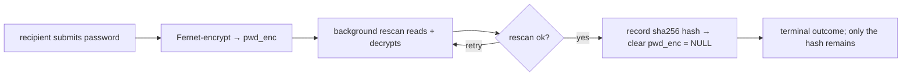

---

# 6. Security

This document is the single place describing the service's security model: what is
protected, how, and what an operator must know — including the **rate-limit /
lockout behaviour and how to recover**.

## Attack surface at a glance

| Surface | Path | Protection |
|---------|------|------------|
| EX webhook | `POST /webhook/ex-alert` | HTTP Basic auth **and/or** source-IP allowlist; body-size cap; 503 until configured. |
| Recipient form | `GET/POST /p/<token>` | Unguessable signed, TTL-expiring token; single-use by case state; per-(IP+token) rate limit. |
| Admin dashboard/API | `/`, `/settings`, `/api/*` | Signed session cookie (12h); per-IP login rate limit. |
| Health | `/healthz` | Public, no data. |

## Secrets at rest

Everything sensitive is encrypted with **Fernet** (AES-128-CBC + HMAC), keyed by a
key derived from `SECRET_KEY` (`crypto.fernet`):

- **The attachment password** (`AttachmentCase.pwd_enc`) — held encrypted only from
  submission until the EX rescan succeeds, then purged (`NULL`). This transient
  storage is what lets the rescan auto-retry without re-asking the recipient. Only a
  SHA-256 hash survives, for audit.
- **UI-saved settings secrets** (`settings.value` where `is_secret`) — EX password,
  SMTP password, EX client token, webhook password, IMAP password, and the admin
  password (`ui_password`).

> **Rotating `SECRET_KEY`** invalidates every encrypted value: any held password
> becomes unreadable (the case will report the password unreadable and go to
> `RESUBMIT_FAILED`) and stored settings secrets must be re-entered. Rotate
> deliberately.

## `SECRET_KEY` — no shipped default

The service **never ships a usable default key**. On startup `resolve_secret_key`:

1. uses an explicit `SECRET_KEY` from the environment if set (and not a placeholder
   like `change-me`); otherwise
2. reads a previously generated key from `./secret.key`; otherwise
3. generates a strong random key (`secrets.token_urlsafe(48)`) and persists it to
   `./secret.key` with `0600` permissions.

`secret.key` is **gitignored**. This removes the classic "everyone runs the same
`change-me` key" weakness while keeping tokens and sessions stable across restarts.
Keep `secret.key` safe and backed up; deleting it invalidates all links and
sessions (and any DB-stored secrets).

## One-time links (recipient tokens)

- Signed with `itsdangerous` (HMAC), carrying the case id, salted `password-link`.
- **TTL-expiring** (`TOKEN_TTL`, default 24h). Opening an expired-but-validly-signed
  link auto-reissues a fresh one if the case still awaits a password.
- **Single-use** is enforced by **case state**, not the token: once a password is
  submitted the case leaves `AWAITING_PASSWORD`, so a replayed link is rejected.
- Tokens are unguessable; the form is additionally rate-limited (below).

## Admin authentication

- Shared password `UI_PASSWORD`, compared **constant-time** (`hmac.compare_digest`).
- On success, a signed session cookie `ui_session` (`httponly`, `samesite=lax`,
  12h TTL) is issued. All `/api/*` and admin pages require it.
- `SECRET_KEY` signs the cookie, so cookies are unforgeable without it.

## Webhook authentication

The webhook refuses to serve unless webhook auth is configured. It accepts a POST
only when:

1. the service **is configured** (else `503` — see setup mode), and
2. HTTP Basic credentials match (constant-time), **and/or**
3. the source IP is in the allowlist,

then it caps the body at `MAX_REQUEST_BYTES` before parsing.

## Rate limiting & lockout — and how to recover

Two **per-IP, self-healing sliding-window** limiters (`web/ratelimit.py`). There is
**no permanent lockout** and nothing an operator must manually unlock.

| Limiter | Key | Default | On exceed |
|---------|-----|---------|-----------|
| Admin login | client IP | 10 / 15 min | `HTTP 429`; clears as the window rolls off, and immediately on a successful login. |
| Password form | client IP **+** token | 10 / 5 min | `HTTP 429`; clears as the window rolls off. |

**Is lockout by IP?** Yes. The login limiter counts attempts per client IP; the
password-form limiter per IP **and** link. Counters live in memory only.

**Recovering from a login lockout** — any one of:

1. **Wait** — the window is short (15 min by default); the counter rolls off on its
   own.
2. **Restart the service** — counters are in-memory, so a restart clears them
   instantly.
3. **Use a different source IP** — the limit is per-IP.

A **successful** login also resets that IP's counter immediately, so a legitimate
admin who simply mistyped is not penalised once they get it right.

> Because there is no durable lockout state, there is no "unlock" button and no risk
> of bricking the admin account. The admin password itself is set via config/GUI,
> not recoverable-by-email; if it is *forgotten* (not locked out), reset it by
> setting `UI_PASSWORD` in the environment and restarting.

### Reverse proxies and the client IP

Behind a proxy the socket peer is the proxy, so all requests would share one IP. Set
`TRUST_FORWARDED_FOR=true` **only** when actually behind a trusted proxy that sets
`X-Forwarded-For`; the service then keys limits on the left-most forwarded address.
Leaving it off is safe (the header is otherwise spoofable and would defeat the
limit).

## First-run setup mode

Until the service `is_configured()` (EX creds, SMTP, public URL, admin password, and
webhook auth all present) it runs in **setup mode**:

- The webhook returns **503** — EX is told to retry rather than have alerts silently
  dropped.
- While **no admin password exists**, `/settings` and the settings API are reachable
  **without auth** — the only way to bootstrap the first password. The instant a
  password is set, setup mode ends and normal auth is enforced (the UI redirects to
  sign-in).

> **Operational note:** perform first-run setup on a trusted network or behind the
> reverse proxy, because the bootstrap window intentionally opens the settings page.
> It closes as soon as an admin password is saved.

## Denial-of-service hardening

- Request bodies (webhook and form) are capped at `MAX_REQUEST_BYTES` (1 MiB) before
  parsing.
- The password form and admin login are rate-limited.
- EX interactions have caps: `MAX_PASSWORD_ATTEMPTS`, `RESUBMIT_MAX_RETRIES`,
  `NOTIFY_MAX_RETRIES`, `RECHECK_MAX_ATTEMPTS` — no unbounded loops against EX.

## Repository hygiene

- `.claude/settings.json` denies reading/writing `.env*` and `*.sqlite3`.
- `.gitignore` excludes `.env*`, `secret.key`, `*.sqlite3`, log files, the vendor
  PDFs, and this `documentation/` folder.
- The attachment password is never logged in plaintext; a truncated SHA-8 fingerprint
  is logged at rescan time only to diagnose whitespace mismatches.

## Threat notes / residual risks

| Risk | Mitigation / status |
|------|--------------------|
| Password interception in transit | HTTPS terminated at the proxy; links are single-use and short-lived. |
| Replay of a captured link | Rejected by case state after first submission. |
| Brute-force of a token | Tokens are HMAC-signed and unguessable; form is rate-limited. |
| Compromise of `secret.key` | Grants decryption of stored secrets — protect the file (0600) and the host. |
| Setup-mode window | Time-boxed to before the first admin password; do setup on a trusted network. |
| Shared IP behind a proxy | Enable `TRUST_FORWARDED_FOR` so limits key on the real client. |

---

# 7. User Guide

A practical, step-by-step guide to installing, configuring, and operating the
service. For the security rationale behind these steps see [Security](06_security.md).

---

## 1. Prerequisites

- **Python ≥ 3.11**.
- Network reachability to your **Trellix EX** appliance (WSAPI) and an **SMTP**
  relay for outbound mail.
- An EX API account with the **API Analyst** role.
- (Optional) an **IMAP** mailbox for the `SMTP_FROM` sender, to detect bounces.
- A **reverse proxy** terminating HTTPS in front of the service (recommended).

## 2. Install

```bash
python -m venv .venv && source .venv/bin/activate
pip install -e ".[dev]"
```

## 3. Configure — two ways

You can configure the service entirely from the **web UI** (recommended, guided by
setup mode), or via environment variables / a `.env` file, or a mix. The UI writes
overrides to the database; the environment provides the defaults.

### Required settings

The service will not leave **setup mode** (and the webhook stays disabled) until all
of these are set:

| Setting | Purpose |
|---------|---------|
| `EX_BASE_URL`, `EX_USERNAME`, `EX_PASSWORD` | Reach and authenticate to EX. |
| `SMTP_HOST`, `SMTP_FROM` | Send the recipient email. |
| `PUBLIC_BASE_URL` | Build the one-time link (must match how recipients reach you). |
| `UI_PASSWORD` | Admin dashboard password (can be set in the UI on first run). |
| Webhook auth | `WEBHOOK_USERNAME`+`WEBHOOK_PASSWORD` and/or `WEBHOOK_IP_ALLOWLIST`. |

> **`SECRET_KEY` is not required** — leave it blank and a strong key is generated
> and saved to `./secret.key` on first run. **`DB_URL`** is environment-only.

### Option A — guided first-run setup (recommended)

1. Start the service with nothing configured (or only `DB_URL`):
   ```bash
   python -m trellix_decrypt
   ```
   The log shows `SETUP MODE — configuration incomplete, missing: …`.
2. Open `http://<host>:8080/` in a browser. You are redirected to **Settings**
   (no password required yet — this is the bootstrap window).
3. Fill in **Admin password** first, plus the EX, SMTP, public URL, and webhook
   fields. Click **Save changes**.
4. Setting the admin password ends setup mode; the UI redirects you to **sign in**.
   Log in with the password you just set.
5. The dashboard's "configuration incomplete" banner should be gone. The webhook is
   now live.

> Do first-run setup on a trusted network or behind your proxy — the bootstrap
> window intentionally opens the settings page until the admin password is set.

### Option B — environment / `.env`

```bash
cp env.example .env   # then edit .env (never committed)
python -m trellix_decrypt
```

`env.example` documents every variable with comments. Key groups: EX appliance,
trigger rules, SMTP, web/links, webhook auth, **security/rate limiting**, flow
tuning, bounce/IMAP, logging, storage.

## 4. Point EX at the webhook (add it as an HTTP notification destination)

EX delivers alerts to this service through its **HTTP notifications** feature: EX
posts a notification to one or more web servers when a malware object is detected.
You register this service as one of those servers, on the EX Web UI's **Notification
Settings** page. It has two parts — the shared **HTTP Settings** (defaults) and the
per-server entry — both under **Settings → Notifications → HTTP**.

> **Source:** *Trellix Email Security – Server User Guide, Release 11.x — "Configuring
> HTTP notifications using the Web UI"* (PDF in `docs/`; also online:
> [Notification settings](https://docs.trellix.com/bundle/ex_11.x_ug/page/UUID-48d03d0d-9e19-447e-1e07-775b91a5b021.html)
> ·
> [HTTP notifications](https://docs.trellix.com/bundle/ex_11.x_ug/page/UUID-25f43f87-0950-3685-63a3-9152b2ec2df8.html)).
> Requires **Admin** or **Operator** access, and the appliance needs network reach to
> this service. Field names below are verbatim from that guide.

### 4a. HTTP Settings (defaults)

1. On the Web UI, select the **Settings** tab.
2. Select **Notifications** on the side bar.
3. Click the **HTTP** tab to display the **Define Protocol Settings** area.
4. **Default delivery** — choose **Per Event** (Trellix-recommended; sends a
   notification each time an object is detected). *This service expects per-event
   pushes, not the Daily Digest.*
5. **Default provider** — leave **Generic** (recommended).
6. **Default format** — choose **JSON**, at **Normal** or **Extended** detail. *Do not
   use Concise* — this service needs fields (recipients, queue id, malware names) that
   the fuller formats include.
7. Click **Apply Settings** (changes are lost otherwise).

### 4b. Add the HTTP server (this service)

1. **Settings → Notifications → HTTP** tab → the **View and Add HTTP Servers** area.
2. Click **Add HTTP Server**.
3. In the **Server Name** box enter a name, e.g. `attachment-decrypt`, then click
   **Add New HTTP Server**. *(Do not put a URL in Server Name.)*
4. Select the **Enabled** checkbox for the new server.
5. In the **Server URL** box enter this service's webhook (reachable from the
   appliance):

   ```
   https://<your-public-host>/webhook/ex-alert
   ```

6. Click **Add New HTTP Server** to save the listing.

### 4c. Configure the server entry

1. In the **View and Add HTTP Servers** list, click the **edit** (pencil) icon for the
   server.
2. **Auth** — select the **Auth** checkbox and enter the **Username** and **Password**
   to match this service's `WEBHOOK_USERNAME` / `WEBHOOK_PASSWORD`. *(If you leave Auth
   off, you must instead put the appliance's source IP in `WEBHOOK_IP_ALLOWLIST` — this
   service requires Basic auth and/or an IP allowlist.)*
3. **Notification** — select **All Events** (safest: it delivers the riskware/malware
   alerts that carry the `CustomPolicy.MVX.<ext>` detection *and* the `_RA`
   re-detections). **Malware Object** also works if your encrypted-attachment policy
   surfaces under it.
4. **Delivery** — **Per Event** (recommended).
5. **SSL Enable** + **SSL Verify** — select both if the endpoint is HTTPS (it should
   be; TLS is terminated by your reverse proxy). Use a certificate from a CA the
   appliance trusts.
6. **Default provider** — **Generic**.
7. **Message Format** — **JSON**, at **Normal** or **Extended** (or **Default** to
   inherit 4a). Not **Concise**.
8. Click **Update**.

### 4d. Verify

Trigger or wait for a matching detection and confirm a `POST /webhook/ex-alert`
appears in this service's log (`LOG_FILE`) and the quarantined email shows up as a
case in the dashboard.

> **The `_RA` re-detection uses this same server.** After a resubmission, EX posts the
> re-analysis result to the *same* HTTP notification — no second destination is needed,
> which is why **All Events** / per-event delivery is recommended above.

## 5. Verify EX connectivity

Before relying on the webhook, run the self-test:

```bash
python -m trellix_decrypt --check
```

It logs in and runs a small alerts + quarantine query using the **effective**
settings, prints a readable report, and exits `0` on success.

## 6. The trigger rule

The flow fires only when an alert's top-level **name** equals `TRIGGER_ALERT_NAME`
(default `RISKWARE_OBJECT`) **and** one of its malware names exactly matches one of
`TRIGGER_MALWARE_NAMES`. The encrypted-attachment custom policy emits
`CustomPolicy.MVX.pdf` / `.zip` / `.docx` (and a `…PassExtractFailed` variant).

- Leaving `TRIGGER_MALWARE_NAMES` **empty disables triggering** entirely.
- Unrelated `CustomPolicy.MVX` rules (e.g. QR-code detections) must **not** be
  listed — matching is exact.

## 7. Run in production

```bash
python -m trellix_decrypt
# or the console script:
trellix-decrypt
```

Put it behind a reverse proxy that terminates HTTPS. If the proxy is trusted, enable
`TRUST_FORWARDED_FOR=true` so rate limits key on the real client IP.

## 8. Daily operations (the dashboard)

Sign in at `/`:

- **Case list** — searchable, auto-refreshing, with status badges and a
  password-failure counter.
- **Case drawer** — lifecycle stepper + event timeline; and, best-effort, full EX
  alert detail fetched by UUID.
- **Actions** — **Resend** a link (for `Email failed` / `Awaiting` / `Bounced`
  cases) and **Rescan** (re-run a pending resubmission).
- **Settings** (`/settings`) — every configurable option, applied **live** on save
  (except items tagged *restart to apply*: bind host/port, logging, rate-limit
  windows).

## 9. Settings reference (in the UI)

| Section | Notable fields |
|---------|----------------|
| Admin access | **Admin password** (required; bootstraps sign-in). |
| Trellix EX | Base URL, username/password, verify TLS, client token, rescan path id, timeout. |
| SMTP | Host/port, credentials, from, TLS mode, HELO hostname, verify TLS. |
| Bounce (IMAP) | Host/port/credentials/mailbox, SSL, poll interval (blank host = disabled). |
| Trigger | Alert name, malware names (CSV). |
| Web & webhook | Public URL, webhook username/password, **IP allowlist**, link lifetime. |
| Security & rate limiting | Login/form limits & windows, trust X-Forwarded-For, max body bytes. |
| Logging *(restart)* | Level, file, rotation. |
| Infrastructure *(restart)* | Bind host/port. (`DB_URL` is env-only.) |

## 10. Troubleshooting

| Symptom | Likely cause / fix |
|---------|--------------------|
| Webhook returns **503** | Service in setup mode — finish required config (see the dashboard banner). |
| Webhook returns **401** | Missing/bad Basic auth, or webhook auth not configured. |
| Webhook returns **403** | Source IP not in `WEBHOOK_IP_ALLOWLIST`. |
| Everything reads **Passed** / **Quarantined** wrongly, or rescan says "queue id not found" | Check the **EX appliance clock**. Per-case lookups use a clock-independent window, but a badly wrong EX clock has caused rescans to fail; fixing the clock resolves it. |
| Recipient link says expired | Links TTL-expire (`TOKEN_TTL`); opening one auto-reissues a fresh link if still awaiting a password. |
| Emails not sending | Check SMTP settings; failed sends go to `Email failed` and are auto-retried and resendable. Check `SMTP_TLS_MODE` and `SMTP_HELO_HOSTNAME` (some servers demand an FQDN). |
| Rescan keeps failing | Try flipping `EX_RESCAN_ID_FIELD` between `queue_id` and `email_uuid`; check the EX account's rescan permission. Failures retry under `RESUBMIT_MAX_RETRIES`. |
| Locked out of the admin login (429) | Wait out the window (15 min), **restart** the service, or use another IP. A correct login also clears the counter. See [Security](06_security.md). |
| Held password unreadable / secrets blank after a change | `SECRET_KEY` changed or `secret.key` was deleted — Fernet can't decrypt old values. Re-enter settings secrets; affected cases go to `RESUBMIT_FAILED`. |

## 11. Backups

Back up **two** things together:

1. the **database** (`DB_URL`, e.g. `trellix_decrypt.sqlite3`), and
2. **`secret.key`** — without it the encrypted settings in the DB are unreadable.

## 12. Test

```bash
pytest        # unit + respx-mocked EX client tests
```

---

# 8. Tech Stack

The technologies the service is built on, organised by the layer they serve. Exact
version pins live in `pyproject.toml`; the roles below explain *why* each is here.

## Where each technology sits

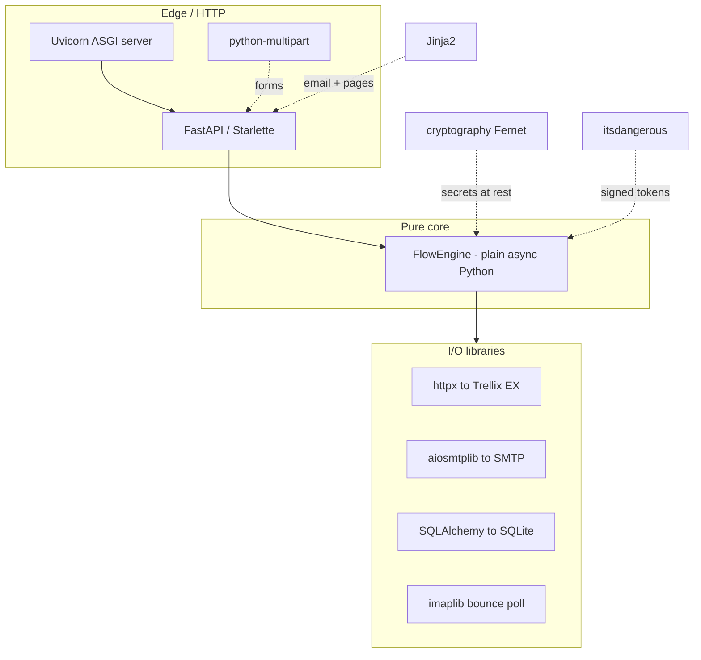

## At a glance

| Layer | Technology | Role |
|-------|------------|------|
| Language / runtime | **Python ≥ 3.11** | Async throughout (`asyncio`). |
| Packaging | **setuptools** (`pyproject.toml`) | Console entry point `trellix-decrypt`. |
| Web framework | **FastAPI** (≥ 0.110) | Webhook, password form, dashboard, JSON API. |
| ASGI server | **Uvicorn** (`[standard]`, ≥ 0.29) | Serves the app. |
| Routing / test client | **Starlette** (via FastAPI) | Routing; `TestClient` in tests. |
| Form parsing | **python-multipart** (≥ 0.0.9) | The password submission form. |
| HTTP client | **httpx** (≥ 0.27) | Async client for the Trellix WSAPI. |
| ORM | **SQLAlchemy 2.0** | `AttachmentCase`, `PasswordAttempt`, `EventLog`, `Setting`. |
| Database | **SQLite** (default, via `DB_URL`) | Local persistence; swappable. |
| Config | **pydantic-settings** (≥ 2.2) | `Settings` from env/`.env` + DB overrides. |
| Crypto | **cryptography** (≥ 42.0) — **Fernet** | Encrypts the held password and stored secrets. |
| Signing | **itsdangerous** (≥ 2.1) | One-time links + admin session cookie. |
| Email send | **aiosmtplib** (≥ 3.0) | Async SMTP delivery. |
| Templating | **Jinja2** (≥ 3.1) | Email bodies and web pages. |
| Bounce detection | **imaplib** (stdlib) + DSN parsing | `bounce.py` flips bounced mail to `BOUNCED`. |
| Frontend | Vanilla **HTML / CSS / JS** | `static/*.js`, `static/style.css`; no build step. |
| Tests | **pytest** + **pytest-asyncio** | Unit + web tests (auto async mode). |
| HTTP mocking | **respx** (≥ 0.21) | Mocks the EX API in tests. |
| Linting | **Ruff** (≥ 0.4) | Linter. |
| External system | **Trellix EX WSAPI v2.0.0** | Alerts, quarantine, rescan, alert-by-uuid. |

## Language & runtime

- **Python ≥ 3.11**, async end-to-end (`asyncio`); type-hinted public functions.
- Packaged with **setuptools** via `pyproject.toml`; run as `python -m trellix_decrypt`
  or the `trellix-decrypt` console script.

## Web / API

- **FastAPI + Starlette** power four surfaces: the EX webhook, the public password
  form, the admin dashboard, and the JSON API — all `async`.
- **Uvicorn** (`log_config=None`, so its access log reaches the app's handlers).
- **python-multipart** parses the recipient's password form POST.

## HTTP client (to the EX appliance)

- **httpx** async client (`ex_client.EXClient`): token auth with automatic re-auth,
  alerts, quarantine list/rescan/release/delete, and the alert-by-uuid detail call.

## Data & persistence

- **SQLAlchemy 2.0** ORM over **SQLite** by default; the repository returns detached
  instances so the pure core treats cases as value objects.

## Config & validation

- **pydantic-settings** builds `Settings` from environment/`.env`, overlaid with
  UI-editable overrides persisted in the `Setting` table.

## Security & crypto

- **cryptography (Fernet)** encrypts the transient attachment password and stored
  settings secrets, keyed by `SECRET_KEY`.
- **itsdangerous** signs the TTL-expiring one-time links and the admin session cookie.
- Rate limiting and webhook auth are hand-rolled on top of Starlette primitives —
  no extra dependency (see [Security](#doc-06_security)).

## Email

- **aiosmtplib** for async SMTP send; **Jinja2** renders the text+HTML notification;
  **imaplib** (stdlib) polls the sender mailbox for bounces (`bounce.py`).

## Frontend (no build step, no framework)

- Vanilla **HTML / CSS / JavaScript** served through Jinja2 templates:
  `static/app.js` (dashboard), `static/settings.js`, `static/style.css` (light/dark).

## Testing & tooling

- **pytest** + **pytest-asyncio** (auto mode); **respx** mocks the EX HTTP API so the
  client is tested without a live appliance; **Ruff** lints.

## External system integrated

- **Trellix Email Security (EX)** WSAPI **v2.0.0** (Reference Release 2025.1): token
  auth via `X-FeApi-Token` (+ optional `X-FeClient-Token`), alerts, quarantine
  management, rescan, and the alert-by-uuid detail endpoint.

---
